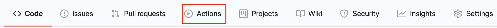

# GitHub Actions

GitHub Actions are an automation feature build into GitHub.  They allow actions to be triggered as a result of activity, such as a push or pull request, on a repository

GitHub Actions are easy to set up and are available on both the free and paid GitHub plans.  Note: Actions are not yet available on all Enterprise Git sites.  

You can easily tell if your git project is enabled for Actions by seeing if there is an Action section:



[Full documentation](https://help.github.com/en/actions){target=_blank} is available for GitHub actions, but follow these simple steps and use this repository as a reference.  The action used in this project publishes the project documentation (in the **docs** folder of the repo) to a GitHub pages site using the MkDocs static site generator.

1. Create a **.github** directory in your repository
2. Add an **actions** directory inside the **.github** directory
3. Create an action to generate and publish the site using [MkDocs](https://www.mkdocs.org){target=_blank} (*see below for instructions*)
4. Add a **workflows** directory inside the **.github** directory
5. Create a workflow to checkout the code from git and then run the action created in step 3 to generate the site

## Actions

An action is an individual task, which can be run as part of a workflow initiated when something happens on a GitHub repository.  There is a [marketplace](https://github.com/marketplace?type=actions){target=_blank} of actions available or you can create your own private actions.

In this example a private action is created.

Private actions can exist in the git repository where they will be used.  I recommend adding them within the .github directory to separate the GitHub action configuration with the primary purpose of the github repository.

See the [documentation](https://help.github.com/en/actions/creating-actions){target=_blank} for all the options for creating actions, but this example uses a container to perform the operations of the action.

An action is defined by a configuration file, called **action.yml**, again the syntax of the config file is described in the [documentation](https://help.github.com/en/actions/creating-actions/metadata-syntax-for-github-actions){target=_blank}.  The **action.yml** file for this project contains the following:

```yaml
# action.yml
name: 'Deploy to GitHub Pages'
description: 'Publish Markdown docs as GitHub Pages static site'
runs:
  using: 'docker'
  image: 'Dockerfile'
```

Here you see a name and description, then a **runs** section which uses a Docker container to perform the work.  The Docker container image can be specified using a **Dockerfile** - the path is relative to the **action.yml** file, so in this case in the same directory.  It is also possible to specify an image from a public image repository, such as Docker Hub.

The Docker file for this project contains the following:

```dockerfile
FROM python:alpine

RUN apk add --no-cache \
    build-base \
    git \
    git-fast-import \
    openssh

RUN pip install --no-cache-dir mkdocs

COPY entrypoint.sh /entrypoint.sh
RUN chmod +x /entrypoint.sh

ENTRYPOINT ["/entrypoint.sh"]
```

which simple installs the prerequisite packages to install and build the mkdocs runtime, then copies in the script which will run when the contain is run.

The entrypoint script contains the following:

```sh
#!/bin/sh

mkdocs gh-deploy --config-file "${GITHUB_WORKSPACE}/mkdocs.yml" --force
```

which simple runs the mkdocs command, with the **gh-deploy** option to deploy to github pages.  Notice the use of the **GITHUB_WORKSPACE** environment variable, which the GitHub Actions runtime initialises at the container startup.

## Workflow

The workflow defines when a GitHub action will run and what actions will be run.  For a project the workflow files must exist in the **.github/workflows** directory structure at the root of the project.

The workflow file (**build.yml**) for this project contains the following:

```yaml
name: GenerateSite

on:
  push:
    branches: [master]
  pull_request:
    branches: [master]
jobs:
  generate:
    name: 'Run mkdocs gh-deploy'
    runs-on: ubuntu-latest
    steps:
      - name: Check out repository
        uses: actions/checkout@v2

      - name: generate site
        uses: ./.github/actions/
```

Here you can see the workflow has a name then the **on** section defines when this workflow will run.  Here I specified that this workflow will only run when something is pushed to the master branch or a pull request is made to the master branch.  Activity on other branches will not trigger this workflow.

When the workflow triggers a single job is run within a Ubuntu Linux container.  The job has 2 steps that are run sequentially.  

The first one uses an action from the marketplace to checkout the latest code from the repository (after the push or pull request that triggered the workflow has taken place).

The second one is our private action to generate the MkDocs site and publish it to GitHub Pages.  Notice the uses property points to the directory containing the **action.yml** file, which is relative to the project root directory.

You can use the **Actions** section of the GitHub web UI to check on the progress of actions and see the status of all Action triggered and provides access to the logs generated by all actions that have previously run.

You can add a badge to your project README.md, to give a visual indication if the latest Action completed successfully.  The badge for this site is created using the following:

```md
GitHub Pages : 
```

## User Limits

GitHub Actions are available on [most](https://docs.github.com/en/actions/getting-started-with-github-actions/about-github-actions){target=_blank} GitHub accounts, though there are [usage limitations](https://docs.github.com/en/actions/getting-started-with-github-actions/about-github-actions#usage-limits){target=_blank}, but for documentation formatting the limitations should not pose an issue.
