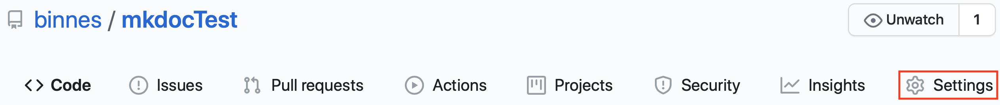
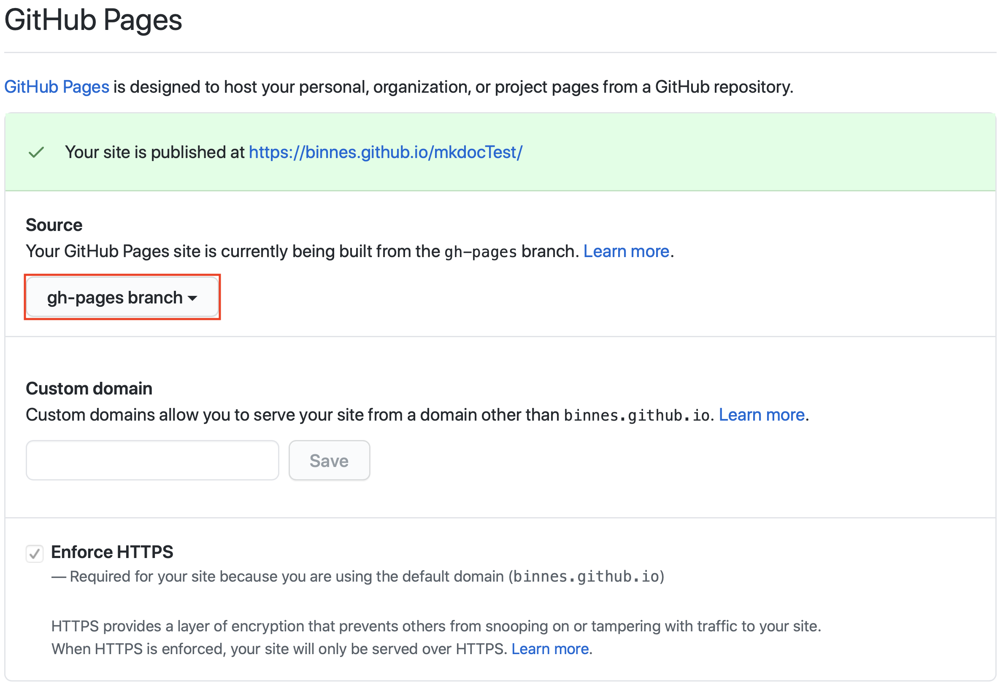

# GitHub Pages

[GitHub Pages](https://help.github.com/en/github/working-with-github-pages){target=_blank} provide the option for GitHub to host a static website for a project.

By default when you create a new repository there is no GitHub Pages site creates, but you can easily configure a site.

To configure GitHub Pages you need to use the GitHub web console and navigate into your project.

1. Select the Settings section.

    

2. Scroll down until you see the GitHub Pages section.  There select the gh-pages branch as the Source for your site.  This option will only be available after the ```mkdocs gh-deploy``` has been run.

    

Once configured you will see the URL for your site
