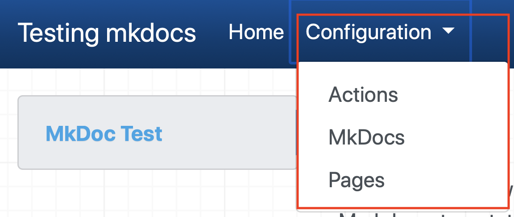

# MkDocs

[MkDocs](https://www.mkdocs.org){target=_blank} is an open source project that takes Markdown documents and generates a static web site.  The static web site does have some useful features, such as navigation and search.

MkDocs is easy to [install](https://www.mkdocs.org/#installation){target=_blank} on all common operating systems and provides a good developer experience, where you can see real time changes as you work on a document.  

You also have multiple [built-in](https://www.mkdocs.org/#theming-our-documentation){target=_blank} or  [community](https://github.com/mkdocs/mkdocs/wiki/MkDocs-Themes){target=_blank} themes available and have the option to customize an existing theme or [create a new theme](https://www.mkdocs.org/user-guide/custom-themes/){target=_blank} the get the documentation layout and style exactly as you want.  For this project the default theme is used.

## Installing MkDocs

Before you can use MkDocs you need to install it.  The [documentation](https://www.mkdocs.org/#installation){target=_blank} provides instructions for installation of the python 3 prerequisites and MkDocs

This project uses some additional plugins and extensions to the core MkDocs, which are discussed later in this section.  You also need to install the extensions and their prerequisites if you want to use the additional features.

## Configuring MkDocs

MkDocs is configured using a file named **mkdocs.yml** located in the root directory of your project.  The minimum configuration is simply a site name.

```yaml
site_name: Testing mkdocs
site_description: >-
  Automatically create formatted documentation from Markdown files in a GitHub repository.
  The Markdown is automatically formatted using Docs, generated when a GitHub pull request or push
  is made to the repository using GitHub Actions and hosted on GitHub Pages.
site_url: https://binnes.github.io/mkdocTest
site_author: Brian Innes
repo_name: binnes/mkdocTest
repo_url: https://github.com/binnes/mkdocTest
edit_uri: ""
use_directory_urls: false
theme:
    name: material
plugins:
  - search
  - with-pdf:
      cover_subtitle: Workshop documentation from Markdown
      output_path: pdf/mkdocs.pdf
markdown_extensions:
  - attr_list
  - admonition
  - toc:
      permalink: true
extra_css:
    - css/extra.css
    - css/pdf-print.css
nav:
  - Home: index.md
  - Actions: GitHubActions.md
  - MkDocs: MkDocs.md
  - Pages: GitHubPages.md
google_analytics:
  - 'UA-172132667-1'
  - 'binnes.github.io/mkdocTest'
```

You can see all the configuration options in the [MkDocs User Guide](https://www.mkdocs.org/user-guide/configuration/){target=_blank}, but some things to note:

- The site_name is a mandatory field and is used as the title for the site.
- The site_description field provides the description header metadata, which is used by a number of tools to summarise the content of a site
- The default location MkDocs looks for docs to render is the **docs** directory in the root of your project.  This can be changed by adding the **docs_dir** configuration option.
- The default location MkDocs will write the rendered site is the **site** directory.  This can be changed by adding the **site_dir** configuration option.
- MkDocs automatically adds the **search** plugin to generate a search capability on a generated site, but it must be specified when adding a **plugins** section to use additional plugins
- The default theme is **mkdocs**, but this can be altered using the **theme** configuration options.
- The **attr_list** Markdown extension has been enabled to allow [additional HTML attributes](https://python-markdown.github.io/extensions/attr_list/){target=_blank} to be added to markdown.  This is used to allow links to be opened in a new tab or window rather than leaving the site by adding the **target attribute**.  So the Markdown for the link in this section is specified in Markdown as  : ```[additional HTML attributes](https://python-markdown.github.io/extensions/attr_list/){target=_blank}```
- You control the navigation options of the published site using the **nav** configuration option.
- MkDocs is enabled for Google Analytics, simply specify your details to start collecting data on a site.

This project is using GitHub Actions to generate the site, so the site directory shouldn't be pushed manually into the GitHub repository, so this project has added the **site/** directory to the **.gitignore** file, to prevent it being added to the repository.

## Controlling site navigation

The **nav** configuration controls the navigation on the site.  Different themes can support different levels of navigation nesting and offer different navigation options on the page.  

You can control the navigation nesting by adding a section in the configuration.  If I changed the navigation for this project to:
  
```yaml
  nav:
  - Home: index.md
  - Configuration:
    - Actions: GitHubActions.md
    - MkDocs: MkDocs.md
    - Pages: GitHubPages.md
```

the navigation now shows the top level **Configuration** option as a drop down list containing the 3 sub-level entries.

{: .center style="width: 50%"}

## Publishing the site

MkDocs has a built in option for deploying to GitHub Pages.  

The default option is to push the generated site to a branch in the GitHub repository called **gh-pages**.  This default can be changed using the **remote_branch** configuration option.

As this project uses a GitHub Action to automatically publish the site when changes are pushed to the master branch it shouldn't be necessary to publish manually.

To manually publish documentation to GitHub Pages:

1. Open a terminal window
2. Navigate to the root directory of your cloned GitHub repository
3. Run the **mkdocs** command:

```sh
mkdocs gh-deploy
```

## Options for customisation

MkDocs works pretty well with the default theme and configuration, but it is possible to change the styling and functionality of the generated site or add more complex Markdown formatting options.

### Options for changing the generated site look and feel

The default **mkdocs** and **readthedocs** themes provide good options for the layout, navigation and style of the generated site, but the [community provided themes](https://github.com/mkdocs/mkdocs/wiki/MkDocs-Themes) offer additional options.  This site is using the **Material** theme from the community.

Using a community theme is usually pretty easy:

1. install the theme - this is usually done using the pip package manager e.g. ```pip install mkdocs-material```
2. configure **mkdocs.yml** to set the theme e.g.

    ```
    theme:
        name: material
    ```

However if none of the provided themes are exactly what is needed then there are 2 options:

1. Customise an existing theme - which is documented in the [MkDocs user guide](https://www.mkdocs.org/user-guide/styling-your-docs/#customizing-a-theme)
2. Generate your own custom theme - which is also documented in the [MkDocs user guide](https://www.mkdocs.org/user-guide/custom-themes/)

!!! note
    If you choose a community theme or generate your own theme, then you might need to modify the Dockerfile for the [GitHub Action](GitHubActions.md) if additional packages are needed for the theme.

### Markdown extensions

MkDocs uses [Python Markdown](https://python-markdown.github.io/) to translate the Markdown files into HTML, which supports [extensions](https://python-markdown.github.io/extensions/).  You can modify the default set of extensions that MkDocs uses to add support for additional Markdown features using the [**markdown_extensions**](https://python-markdown.github.io/extensions/) configuration options in the mkdocs.yml configuration file.

This project has the **attr_list** extension enabled to allow additional HTML attributes to be added when formatting pages.  In this project it is primarily used to add the **target** attributes to external links.  An additional use is to resize an image by specifying a width tag ```{width=600}```

!!! Note
    MkDocs supports HTLM attributes, but if you want to generate a pdf of the site, then you need to avoid HTML attributes and use CSS to control presentation.  So the {width=600} HTML attribute should be rewritten to use CSS, so becomes {style="width: 600"}

If you choose add a Markdown extension, then you may need to modify the Dockerfile for the [GitHub Action](GitHubActions.md) to ensure the extension is installed.  The officially supported extensions are usually installed by default, but third party extensions will need to be installed so they are available when the action is run to generate the site.

#### Example of customisation

Adding the **attr_list** extension we can alter the appearance of images.

!!! warning
    The additional markup used for formatting by Markdown extensions will not be rendered by the GitHub Markdown renderer.  The extended Markdown will appear on pages viewed through the GitHub repository pages.

The Markdown `````` will generate the image below:


However, you may want to change the size of the image, so we can use any of the CSS options for specifying a size (px, em, rem, %, ...).  The following will make the image 50% of the width of the column containing the image: ```{style="width: 50%"}``` which produces the following output:

{style="width: 50%"}

You can also add additional styles to an element, so to centre the above image the following can be used: ```{style="width: 50%; display: block; margin: 0 auto;"}```

which creates the following:

{style="width: 50%; display: block; margin: 0 auto;"}

!!! note
    You can combine customising the style using additional CSS with the attr_list plugin to create a custom style to apply to Markdown.  If the theme provides a suitable style then you can also use it rather than defining a new custom style where appropriate.

If I create a file within a css folder inside the docs folder called **extra.css** containing:

```css
img.center {
  display: block;
  margin: 0 auto;
}
```

and configure MkDocs to use that file by adding the **extra_css** configuration to the **mkdocs.yml** configuration file, then I can just apply the class to the image: ```{style="width: 50%" .center}``` which produces the same output as using the style attribute above.

{style="width: 50%" .center}

You may also have noticed the **Note** section above.  This is created using the [**admonition**](https://python-markdown.github.io/extensions/admonition/){target=_blank} Markdown extension and the following Markdown text:

```Markdown
!!! note
    You can combine customising the style using additional CSS with the attr_list plugin to create a custom style to apply to Markdown.  If the theme provides a suitable style then you can also use it rather than defining a new custom style where appropriate.
```

The default **mkdocs** theme supports admonition tags of **note**, **warning** and **danger**.  You can add additional tags by creating custom CSS in the **extra.css** file.

### Plugins

Plugins provide more advanced customisation within MkDocs, such as providing the search capability within the generated static site.  You can create your own plugins or use one of the [community provided plugins](https://github.com/mkdocs/mkdocs/wiki/MkDocs-Plugins) to add additional capability to the generated site.

Again any plugins used in a site will need to be installed, so the Docker file for the [GitHub Action](GitHubActions.md) will need to be modified to ensure all plugins are available when the action runs to generate the site.

## Generating PDF documentation for your site

In additional to a static web site, MkDocs can also generate a PDF file containing all the documents in the site combined into a single PDF.  To do this you need to use a plugin.  There are a number of plugins available that will generate a pdf, but the one I use is called **MkDocs with pdf**.  Before you can use it you need to install it along with the prerequisites.  The installation is documented in the [plugin project README file](https://github.com/orzih/mkdocs-with-pdf){target=_blank}.

Once the plugin is installed it can be added to the MkDocs configuration file, in the plugin section:

```yaml
plugins:
  - search
  - with-pdf:
      cover_subtitle: Workshop documentation from Markdown
```

!!! note
    You need to add the search plugin when adding the plugins section.  The search plugin is added by default if no plugins section is added, but needs to be manually added when a plugins section is created in the configuration file.

You will see there is an option to provide a subtitle to be placed on the cover page.

Once the plugin has been added to the MkDocs config file it will be run when a **mkdocs build** command is issued, so each time the static HTML site is built then a new pdf will be created.  When using **mkdocs serve** the pdf will not be built.

The default location for the pdf is within the site folder.  A new folder named **pdf** is create and the pdf file is named **document.pdf**.  These defaults can be modified by providing the **output_path** configuration property.

### Explicity define all Markdown pages

When generating a pdf, you need to place all Markdown documents you want included in the pdf in the navigation configuration within the **mkdocs.yaml** configuration file.  

When generating a static site MkDocs will include Markdown pages that are not specified in the site navigation, so long as they are linked to by a page defined in the navigation.  

However, a pdf document needs to have everything explicitly declared as it specifies the order in which the Markdown pages appear in the pdf.  Any page not explicitly declared within the **nav** configuration will not be included in the pdf, so any links to those pages will not work in the pdf.

A common approach to include content which would otherwise not appear in the site navigation is to have an **Appendix** or **Additional Resources** section at the end of the pdf.
